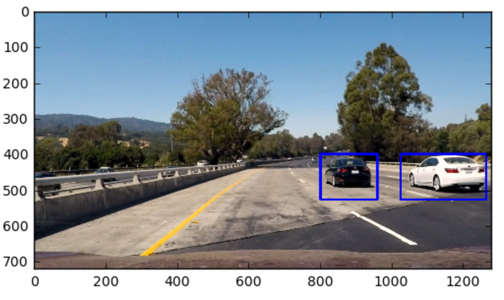

# **Vehicle Detection on Camera Data**



[//]: # (Image References)
[image1]: ./output_images/examples_training_data.png
[image2]: ./output_images/color_histograms.png
[image3]: ./output_images/spatial_binning.png
[image4]: ./output_images/parameter_HOG.png
[image5]: ./output_images/sliding_window1.png
[video1]: ./output_images/test_out_video.mp4
[video2]: ./output_images/test_long_out_video.mp4
[video3]: ./output_images/project_out_video.mp4


## Introduction
Detecting Vehicles from camera images and tracking them is a key technology for designing self-driving vehicles and drive them safely on real traffic situations. In this project, my goal is to create a pipeline to detect vehicles in a video stream and visualize them. This is mainly done by performing a feature extraction. The resuting feature vector contains Histogram of Orieted Gradient features, binned color features and color histogram features as well.

With this data a Linear SVM classifier is trained on a labeled training set of images. This classifier is then used to search for vehicles in images and drawing bounding boxes for vehicles detected. I did this Project during my time at the [](http://www.udacity.com/drive).

---
## Main Approaches and Functions

### Histogram of Oriented Gradients (HOG)

The key elements to solve the problem of vehicle detection in this project are extracting image features and train a linear classifier on this features.
To do so, the concept of Histogram of Oriented Gradients is used. According to wikipedia this technique counts occurrences of gradient orientation in localized portions of an image. The resulting feature can be unique for different given objects within this image, so a classifier may be able to detect specific objects by this unique scheme. 

To understand what HOG features could mean for seperating Cars from Not-Cars lets have a look on Examples of the training data below. 

![alt text][image1]

Here one can see that there is a significant differenz between a car and lets say a lane line. This condition is used in object detection for images. Cars, as they appear in front of a car driving along a road, has a specific shape following specific Gradient Orientations.

### Color Histograms

A second Feature taken into account for identify a car in an image can be the using of color histograms in different color spaces. Usualy the histogram of a car looks different in color, as other objects like trees or bumpers like in the following image.

![alt text][image2]

### Spatial Binning

To reduce the resulting feature vector lenght, spatial binning is also applyed to the feature extraction pipeline to reduce the vector size and smooth the classifier input. This is done by reducing the spatial resolution for the color channels. 

The approach of spatial binning is shown in the image below (from Udacity training materials). It stands out for the later discussed Sub-sampling Window Search, in which the whole image is scanned by the feature pipeline.

![alt text][image3]

### Functions and Parameters

The pipeline consists of three main functions:

```python
def get_hog_features()
```

```python
def bin_spatial()
```

```python
def color_hist()
```

These functions extracting the features for any given image and append them to a feature vector by using the ```numpy.concatenate()``` function. For these functions, a set of parameter is needed as discussed in the following examples:

| Paramter          | Example Value | Description                     |
| ----------------- |:-------------:| -------------------------------:|
| color_space       | 'RGB'         | Colorspace to Analyze           |
| spatial_size      | (128,128)     | Size for spatial resizing       |
| hist_bins         | 64            | No. of Bins for Color Histogram |
| orients           | 5             | No. of Orientations for HOG     |
| pix_per_cell      | 8             | Pixels per Cell                 |
| cell_per_block    | 2             | Cells per Block                 |

Different color spaces can shine or absolutly fail by making features and objects stand out in an image. It depends on image quality, shadows and changing light conditions. Cars with often clearly bright colors represents mostly planes within an image that can be detected reliable throughout different lightning conditions in the right colorspace. The number of bins 
Spatial Size, Pixels per Cell and Cells per Block is best understand by looking at the graphic below (from Udacity Lessons).

![alt text][image4]

Setting these paramters is tricky and depends on the actual goal. One has to distinguish between fast, near realtime vehicle detection in a live camera stream and reliable clear detection in prerecorded videos, where the image processing lasts many times the video lenght. Finding a Compromise relies on smart implementations of the feature extrations pipeline, such as choosing the right sliding windows and guessing the image position from previous detections. Nevertheless my goal in this project was to detect images on a prerecorded video stream with no claim to realtime processing.


At first I tested the impact of the colorspace. As shown in the table, when training the classifier with 1000 images on different color spaces with all the same parameters, differences in accuracy can be mentioned.

| Color Space | Test Accuracy |
| ----------- |:-------------:| 
| RGB         | 0.975         |
| HSV         | 0.985         | 
| LUV         | 0.990         | 
| HLS         | 0.985         | 
| YUV         | 0.995         |
| YCrCb       | 0.997         | 

Following from these, my first choice was the YCrCb Color Space, while Y is the luma component and Cr and Cb are red-difference and the blue-difference chroma components of the image. These other paramters where choosen in trial and error sessions with respect to handle the computation and image processing time.

My final parameterset was the following:

| Paramter          | Example Value | Description                     |
| ----------------- |:-------------:| -------------------------------:|
| color_space       | 'YCrCb        | Colorspace to Analyze           |
| spatial_size      | (32,32)       | Size for spatial resizing       |
| hist_bins         | 32            | No. of Bins for Color Histogram |
| orients           | 9             | No. of Orientations for HOG     |
| pix_per_cell      | 8             | Pixels per Cell                 |
| cell_per_block    | 2             | Cells per Block                 |

I trained a linear SVM Classifier with the default classifier parameters. For the feature vector I used HOG features, spatial binning and color histogram features. After training with 1000 Images, the classifier was able to achieve a test accuracy of 98.5%.

### Sliding Window Search

For searching vehicles I adapted the method ```find_cars()``` from Udacity´s lesson materials. It actualy performs a sliding window search with the features extracted only once for small windows (defined by the ```scale``` parameter) and then overlaying windows can be subsampled for the entire given image region (mainly the bottom half of the image, because other cars would´nt appear in the skybox). The ```scale``` parameter is set on different regions of the image (e.g. small near the horizon, larger in the center). Given the Udacity Lesson Explanation (which is pretty handsome) the ```scale``` parameter is defined as following:

Let´s assume for the sake of simplicity a 64 x 64 window. A scale of 1 would retain a window that's 8 x 8 cells (8 cells to cover 64 pixels in either direction). An overlap of each window can be defined in terms of the cell distance, using cells_per_step. This means that a cells_per_step = 2 would result in a search window overlap of 75% (2 is 25% of 8, so we move 25% each time, leaving 75% overlap with the previous window). Any value of scale that is larger or smaller than one will scale the base image accordingly, resulting in corresponding change in the number of cells per window.

The image below shows a study of the occurance of "cars found events" by my classifier an a test image with different search window scales. The most detections according to the table below are at a small scale arround 1.5 at least for this particular test image.

| Number of Boxes | Scale |
| --------------- |:-----:| 
| 8               | 1.0   |
| 12              | 1.25  | 
| 10              | 1.5   | 
| 7               | 1.75  | 
| 3               | 2.0   |
| 0               | 2.5   |
| 0               | 3.0   |

The color of the boxes is marking their size. One can see lots of false positives in the left side of the image on different scales. To overcome this insecurity of the classifier a heatmap is overlayed which filters all detections below a certain treshold. With the the ```label()``` function from [scipy](https://www.scipy.org/) the filtered heatmap is ultimatly merged into new boxes which defines more likely car occurances.

![alt text][image5]

To improve the performace a class for saving an detections history is created. The last 20 detections where saved into this class and taken into account for creating the heatmap and reducing false positives.

## Solution
### Video Implementation

Below are links to video implementations with different lenghts all from the same main video.

* Here's a link to a short and easy sneakpeek [video](./test_out_video.mp4)
* This [video](./test_long_out_video.mp4) shows a sensitive road section with high danger of false positives
* Here's the link to the full [project video](./project_video.mp4)


### Discussion

The main goal of vehicle detection is for real time traffic tracking on a actual driving car, but this was clearly not my intention to implement in this project. Rather than this the goal was to show technics and underlying functions for detect vehicles in images stream. I achieved this in a pretty solid way. But my pipeline has problems with false detections and processing speed, so I will discuss potential shortcomes and solution approaches.

My final pipeline takes down from 2 Minutes to 10 Minutes to deal with a 50 Seconds video stream, depending on the complexity of my searching pipeline. There is a clear tradeoff between detection accuracy and processing speed within my approach. 

The first Idea to improve the accuracy by not touching execution speed is to train the classifier on a better, more versatile data set with car and not car images which matches the conditions of the video. For this I could generate new data by negative mining the project video. But this whould also overfit the classifier by the given project video, which is kind of useless on general purpose. Using an other classifier or implementing a CNN instead could also improve the performance. 

The second Approach for tweaking this project is to modify the processing pipeline. Using different parameters for HOG, Spatial and Histogram feature extraction whould improve the detection in some points and worsen it on other image conditions. Missdetections will occur in cases where vehicles don't match those in the training dataset and lighting and environmental conditions will also influence the accuracy. 
Tweaking search window size and overlapping strategies could reduce this effects but more robust seems a technic to deal in an appropriate way with false detections because they will always occur. Improving the heatmap and the "save previous occurancy" functions will increase the correct detections rate reliable. For example cars which are leaving the image area or entering are an problematic. Solving this issues could be done by
a tracking strategy for the location of previous detected cars and following the on their likely track (like in the lane lane detection project).
